# 🚀 DX-Ray: The Ultimate Diagnostic Hub

<p align="center" style="font-weight:bolder;">
Your One-Stop Solution Toolkit for Developers, DevOps, and SREs.
</p>

      

### 🌐 **Experience DX-Ray Now** <br> [](https://devtools.foureyedgems.in/)

---

## 📑 Table of Contents
1. [The "One-Stop Solution" Philosophy](#-the-one-stop-solution-philosophy)
2. [Core Features & Benefits](#-core-features--benefits)
3. [Screenshots](#-screenshots)
4. [The Toolkit: 10 Powerful Utilities](#-the-toolkit-10-powerful-utilities-in-3-tracks)
   - [Track 1: DevOps & Infrastructure](#track-1--devops--infrastructure)
   - [Track 2: Developer Utilities](#track-2--developer-utilities)
   - [Track 3: SRE (Site Reliability Engineering)](#track-3--sre-site-reliability-engineering)
5. [Productivity Impact](#-the-productivity-impact)
6. [Architecture & Tech Stack](#-architecture--tech-stack)
7. [Getting Started](#-getting-started)
8. [Contributing](#-contributing)
9. [License](#-license)

---

## 🌟 The "One-Stop Solution" Philosophy

In the modern engineering lifecycle, professionals constantly juggle between dozens of fragmented web tools. You might use one site to test a regex, another to generate a cron schedule, a third to calculate a subnet, and yet another to validate a Kubernetes manifest. 

> **This constant context-switching is an invisible productivity tax that breaks your flow state.**

**DX-Ray** is engineered to be the definitive **One-Stop Solution**. By centralizing these scattered utilities into a single, cohesive, dark-themed environment, DX-Ray eliminates the friction of modern development. 

---

## ✨ Core Features & Benefits

- **Zero Context Switching:** Move seamlessly from decoding a JWT to generating a Kubernetes manifest without ever opening a new tab.
- **Unified, Beautiful Interface:** A consistent, keyboard-friendly, and visually stunning UI across all tools reduces cognitive load.
- **Client-Side Security:** All tools process data instantly on the client side. Your sensitive configurations, IPs, and regex patterns never leave your browser.
- **Instant Feedback Loops:** Real-time validation and generation mean you catch errors before they hit your CI/CD pipeline.
- **Responsive Design:** Works flawlessly on ultra-wide monitors and mobile devices alike.

---

## 📸 Screenshots

### **Main Dashboard Overview:** 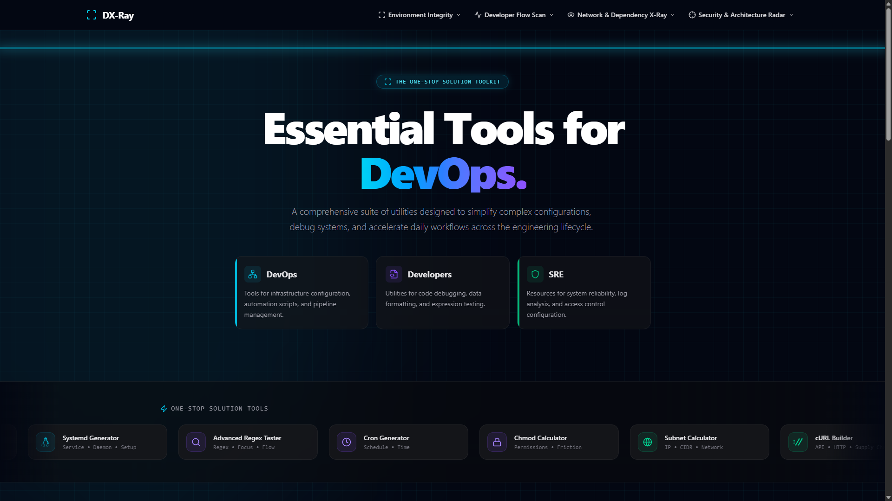

---

## 🛠️ The Toolkit: 10 Powerful Utilities in 3 Tracks

DX-Ray covers three primary engineering tracks, providing specialized, high-performance tools for each discipline.

### Track 1: 🚀 DevOps & Infrastructure
*Tools for infrastructure configuration, automation scripts, and pipeline management.*

*   **☸️ Kubernetes Manifest Studio**
    *   **What it does:** Visually build, edit, and validate complex K8s YAMLs.
    *   **How it helps:** Stops indentation errors and API version mismatches. Generates production-ready Pods, Deployments, and Services in seconds.
    *   ### **Kubernetes Manifest Studio:** 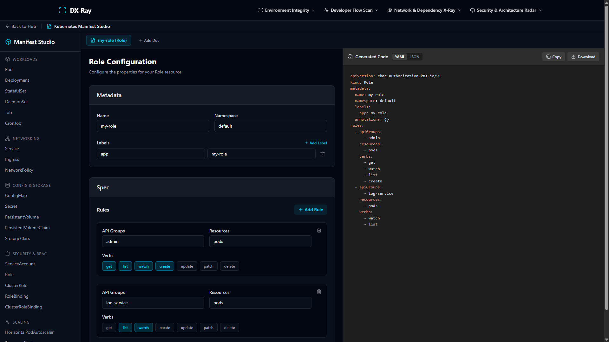

*   **⚙️ Nginx Config Generator**
    *   **What it does:** Generate secure, optimized Nginx server blocks.
    *   **How it helps:** Eliminates the guesswork in configuring reverse proxies, SSL/TLS, and caching rules. Ensures best-practice security headers.
    *   ### **Nginx Config Generator:** 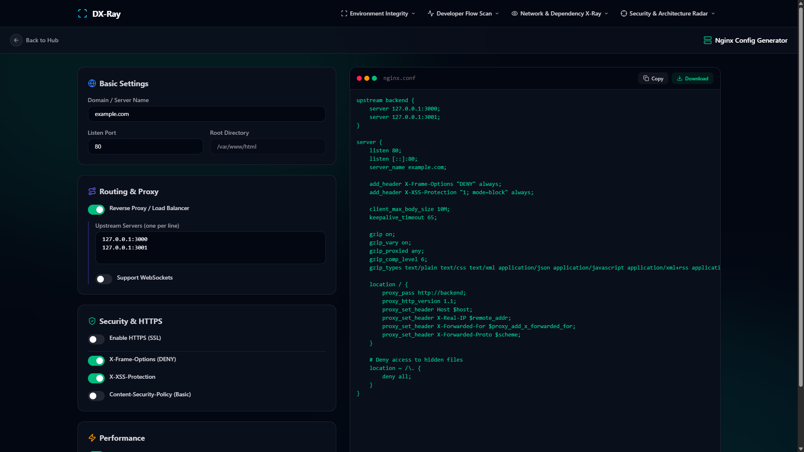

*   **🖥️ Systemd Service Builder**
    *   **What it does:** Create robust systemd service files with ease.
    *   **How it helps:** Simplifies daemonizing applications. Automatically configures restart policies, environment variables, and execution paths.
    *   ### **Systemd Service Builder:** 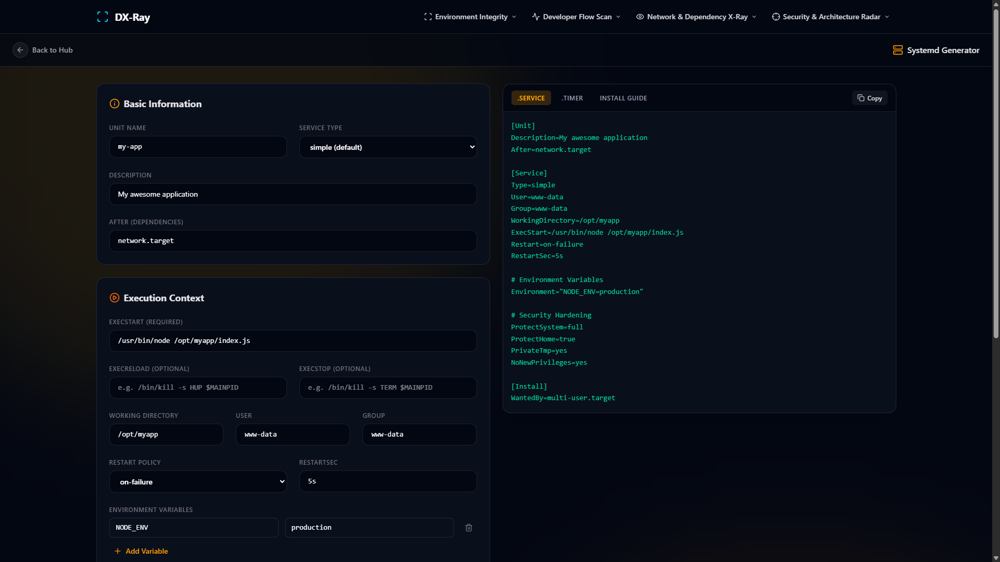

### Track 2: 💻 Developer Utilities
*Utilities for code debugging, data formatting, and expression testing.*

*   **🔍 Regex Tester**
    *   **What it does:** Test and debug regular expressions in real-time.
    *   **How it helps:** Provides instant visual highlighting of matches and groups. Saves hours of trial-and-error when parsing logs or validating input.
    *   ### **Regex Tester:** 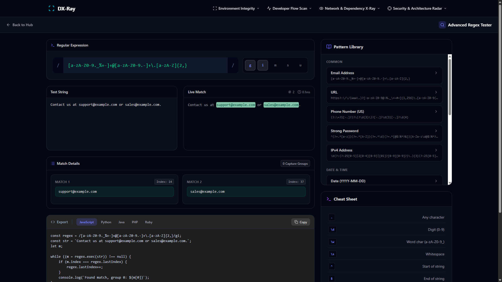

*   **🌐 cURL Builder**
    *   **What it does:** Construct complex cURL requests visually.
    *   **How it helps:** Translates UI inputs (headers, body, auth) into perfectly formatted cURL commands. Great for API testing and documentation.
    *   ### **cURL Builder:** 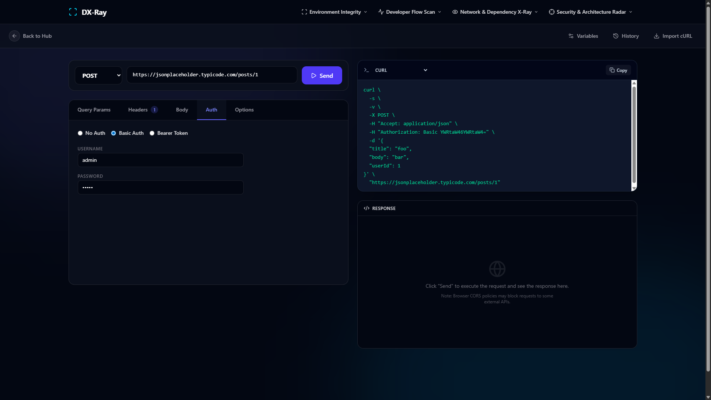

*   **🔒 Chmod Calculator**
    *   **What it does:** Easily calculate Linux file permissions.
    *   **How it helps:** Converts between symbolic (rwxr-xr-x) and octal (755) permissions instantly. Prevents accidental over-permissioning.
    *   ### **Chmod Calculator:** 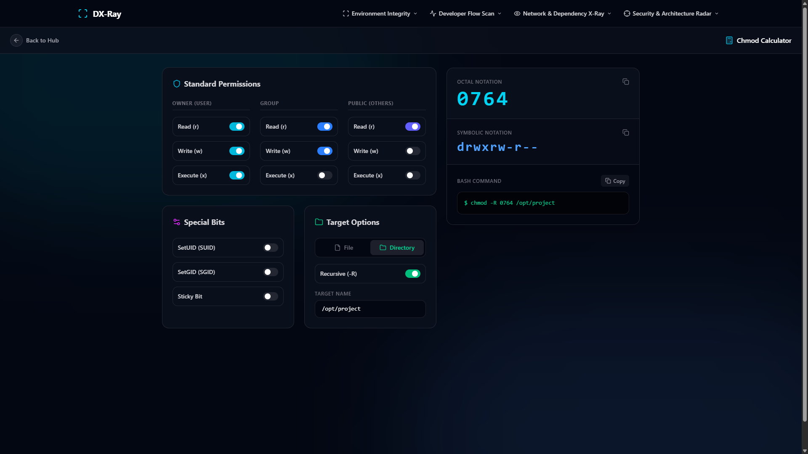

### Track 3: 🛡️ SRE (Site Reliability Engineering)
*Resources for system reliability, log analysis, and access control configuration.*

*   **📊 GraphViz Generator**
    *   **What it does:** Visualize complex architectures and dependencies.
    *   **How it helps:** Turns DOT language into beautiful SVG graphs. Essential for documenting microservices, state machines, and network flows.
    *   ### **GraphViz Generator:** 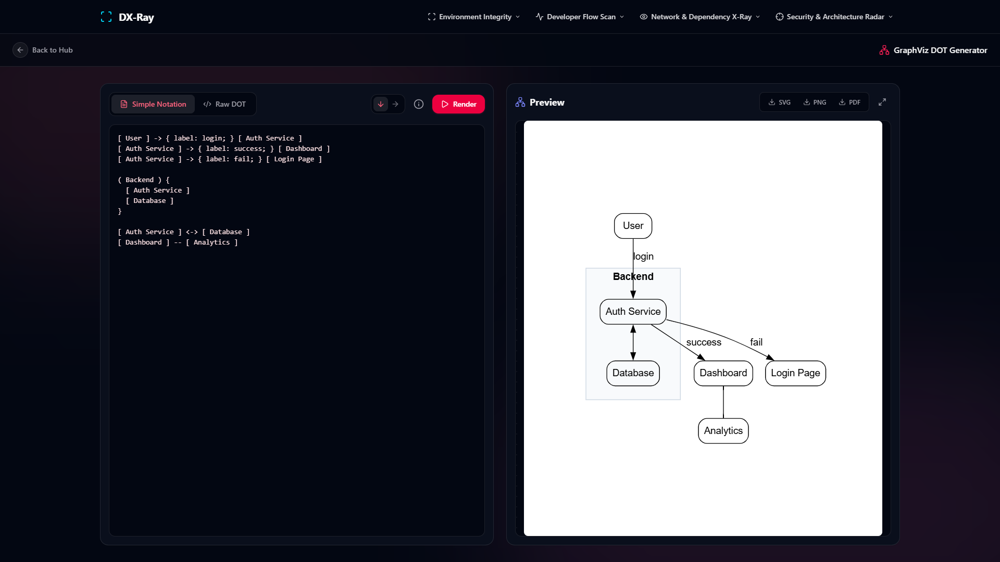

*   **⏱️ Cron Generator**
    *   **What it does:** Build and translate Cron schedules into human-readable text.
    *   **How it helps:** Prevents disastrous scheduling mistakes. Translates `0 0 * * 0` to "Every Sunday at midnight" instantly.
    *   ### **Cron Generator:** 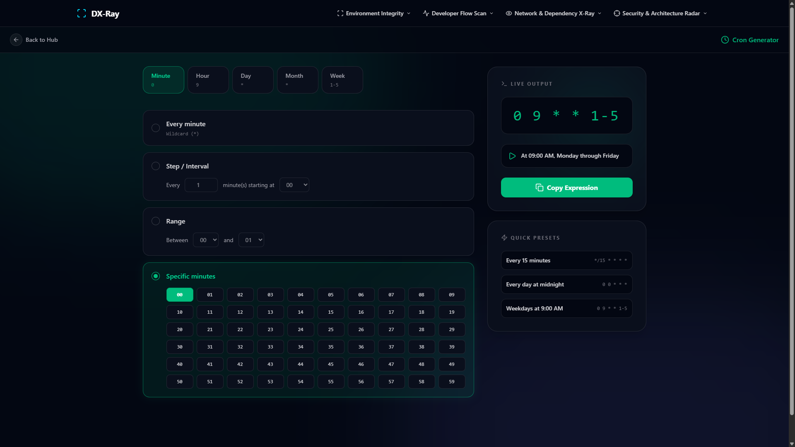

*   **🕸️ Subnet Calculator**
    *   **What it does:** Calculate CIDR blocks, IP ranges, and network masks.
    *   **How it helps:** Crucial for VPC planning. Instantly provides usable IP ranges, broadcast addresses, and wildcard masks.
    *   ### **Subnet Calculator:** 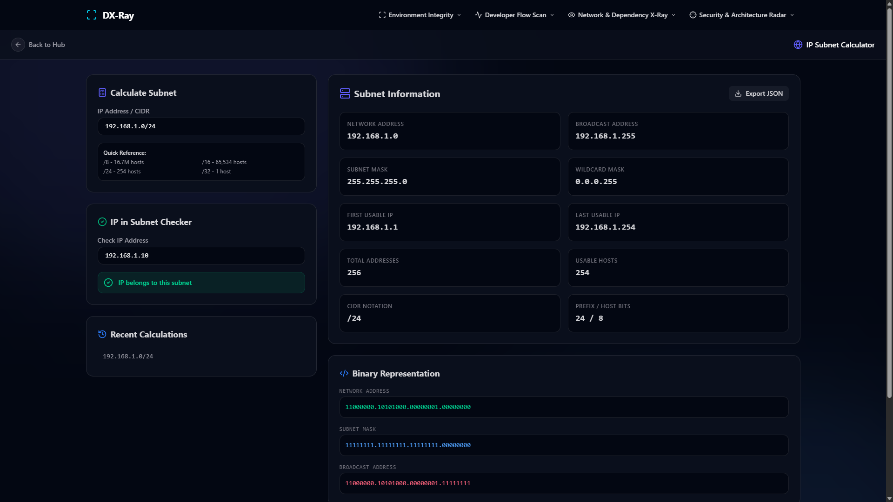

*   **🔑 RBAC Generator**
    *   **What it does:** Generate Kubernetes Role-Based Access Control rules securely.
    *   **How it helps:** Simplifies the complex web of Roles, ClusterRoles, and Bindings. Ensures the principle of least privilege is maintained.
    *   ### **RBAC Generator:** 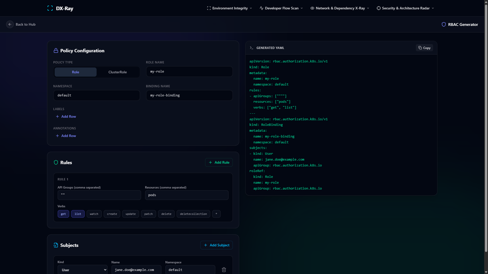

---

## 📈 The Productivity Impact

By adopting DX-Ray as your daily driver, engineering teams experience measurable improvements:

*   **🚀 30+ Context Switches Saved per Hour:** Keep your focus locked on the problem, not on finding the right tool.
*   **⏱️ >15 Minutes Saved per Debugging Session:** Instant, client-side validation cuts down the feedback loop from minutes to milliseconds.
*   **📉 80% Reduction in Syntax Errors:** Visual builders prevent the classic "missed a space in YAML" or "wrong cron syntax" deployment failures.
*   **🧠 Reduced Cognitive Load:** A single, familiar interface means you don't have to re-learn how to use 10 different websites.

---

## 🏗️ Architecture & Tech Stack

DX-Ray is built with modern, high-performance web technologies:

*   **Frontend Framework:** React 18
*   **Language:** TypeScript (Strict Mode)
*   **Styling:** Tailwind CSS (Utility-first, Dark Mode optimized)
*   **Build Tool:** Vite (Lightning-fast HMR and optimized builds)
*   **Icons:** Lucide React
*   **Animations:** Framer Motion (Smooth, physics-based transitions)
*   **Markdown:** React Markdown + Remark GFM

---

## 🚀 Getting Started

To run DX-Ray locally on your machine:

1.  **Clone the repository:**
    ```bash
    git clone https://github.com/yourusername/dx-ray.git
    cd dx-ray
    ```
2.  **Install dependencies:**
    ```bash
    npm install
    ```
3.  **Start the development server:**
    ```bash
    npm run dev
    ```
4.  **Open your browser:**
    Navigate to `http://localhost:3000`

---

## 🤝 Contributing

We welcome contributions from the community! Whether it's adding a new tool, fixing a bug, or improving documentation, your help is appreciated.

1. Fork the repository.
2. Create a new branch (`git checkout -b feature/AmazingFeature`).
3. Commit your changes (`git commit -m 'Add some AmazingFeature'`).
4. Push to the branch (`git push origin feature/AmazingFeature`).
5. Open a Pull Request.

---

## 📄 License

Distributed under the MIT License. See `LICENSE` for more information.

---

> *Built with precision. Designed for speed. Engineered for you.*
